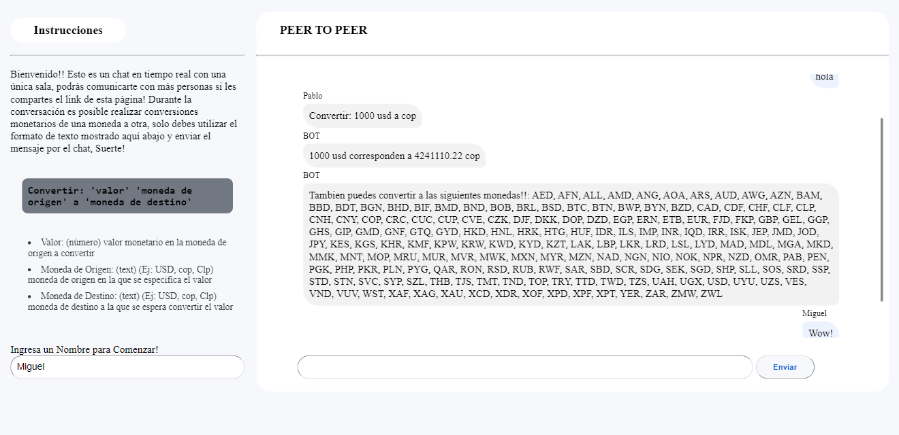

<br/>
<br/>
<h1 align="center">CHAT PEER TO PEER</h1>
<br/>

<p align="center">
    
</p>

## Description

 Real-time chat project with api integration for value conversion between different currencies within the same chat. This project is divided into two parts, the first is an API developed in NodeJS with Espress and TypeScript that consumes an external API for currency conversion and serves this service while allowing to use a server with Socket.io to generate a Peer to Peer communication. The second part is a Responsive WEB SPA developed in ReactJS with typeScript and Vite that allows in a visual way the communication through chat with other people and with the converter.

#### Technologies
<BR/>

<p align="center">
  
  
  
</p>

<br/>

# Backend
## Folder Structure
```
    backend/
    └── src/
        ├── convertions/
        │   ├── Controllers/
        │   ├── dtos/
        │   ├── models/
        │   ├── routes/
        │   └── services/ 
        └── config/
```

## Backend Setup

```bash
# access backend folder
$ cd .\backend\ 
# install dependencies
$ npm install
```

## Compile and run the project

```bash
#into a Backend Folder terminal

# development
$ npm run build

# watch mode
$ npm run dev

# production mode it is necessary to execute the development command
$ npm run start
```

## Resources And Start Process

For this project it's need necessary to consider these points:

1. For start process considere the next steps:
    - execute the command in the Project setup section
    - create an .env file in the root directory with an OPEN_EXCHANGE_API_KEY varibla that contain the access api key for Open Exchenge Rates API
    - ou can copy and paste the following line into the .env file: OPEN_EXCHANGE_URL="https://openexchangerates.org/api" this is the base URL of the Open Exchenge Rates API
    - You must also define a variable MONGO_DB_CONNECTION_STRING that corresponds to the connection to mongo Atlas through a driver.
    - If you need to define a specific port to start the project, you can specify a PORT variable in .env file. By defualt the application listens for this variable.
    -Now you can run one of the commands in the Compile and run the Project section, all this in a terminal in the backend directory.

## Execution of Endpoints
when the application is running you can use any type of method preferred by you to make the request to the following enpoints (this only abailible in localhost enviroment in other environments, the base URL provided by the hosting service should be used.) Remember: This api also works as a communication service for real time chat, the communication is done on the route: `http://localhost:3000` through Socket.io:

- **endpoint** `getRates`

    **description:** This EndPoint allows you to obtain all available exchange rates.

    **Request Example with CURL:**
    ```bash
    curl -x GET "http://localhost:3000/rates"
    ```

- **endpoint** `Convert Currencies`

    **description:** This endPoint is in charge of the conversion of the values.

    **Query params:**
    | Nombre     | Tipo   | Requerido | Descripción                           |
    |------------|--------|-----------|---------------------------------------|
    | `amount` | String | Yes        | is the value sent by the customer to convert.    |
    |`fromCurrency` | String | Yes | is the currency in which the original value is given.  |
    | `toCurrency` | String | Yes | is the currency into which the value is to be converted.. |

    **Request Example with CURL:**
    ```bash
    curl -x POST "http://localhost:3000/conversion" \
    -H "Content-Type: application/json" \
    -d '{"amount": "150", "fromCurrency": "USD","toCurrency": "COP"}'
    ```
<br/>
<br/>

# Frontend
## Folder Structure
```
    frontend/
    └── src/
        ├── components/
        ├── dtos/
        ├── styles/
        └── services/ 
```

## Frontend Setup

```bash
# access frontend folder
$ cd .\frontend\ 
# install dependencies
$ npm install
```

## Compile and run the project

```bash
#into a frontend Folder terminal

# development
$ npm run build

# watch mode
$ npm run dev
```

## Resources And Start Process

For this project it's need necessary to consider these points:

1. For start process considere the next steps:
    - execute the command in the Fronted setup section
    - create an .env file in the root directory with an VITE_CHAT_AND_CONVERTION_API_SERVER varibla that contain the  API URL of the server
    - The project has been created with Vite in NodeJS, so if you clone the repository and use the frontend you must run it in nodeJS to avoid configuration errors with the environment that allows you to run the project.


